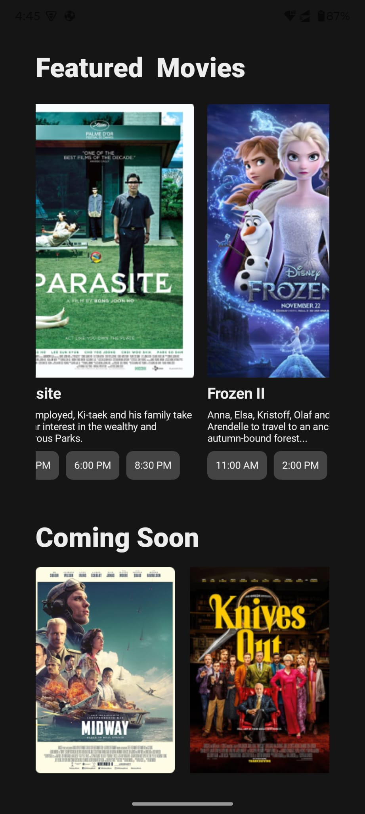

 

  

  <h3 align="center">Theater App UI Using Kotlin Jetpack Compose</h3>

  

    Theater App Android UI Using Kotlin Jetpack Compose
     
     
  

## About The Project
| Home View                         |
|-----------------------------------|
| |

## Built With

Kotlin Jetpack Compose

## Authors

* **Vishnu Priyan** - *Mobile Application Developer* - [Vishnu Priyan](https://github.com/vishnu32510)

